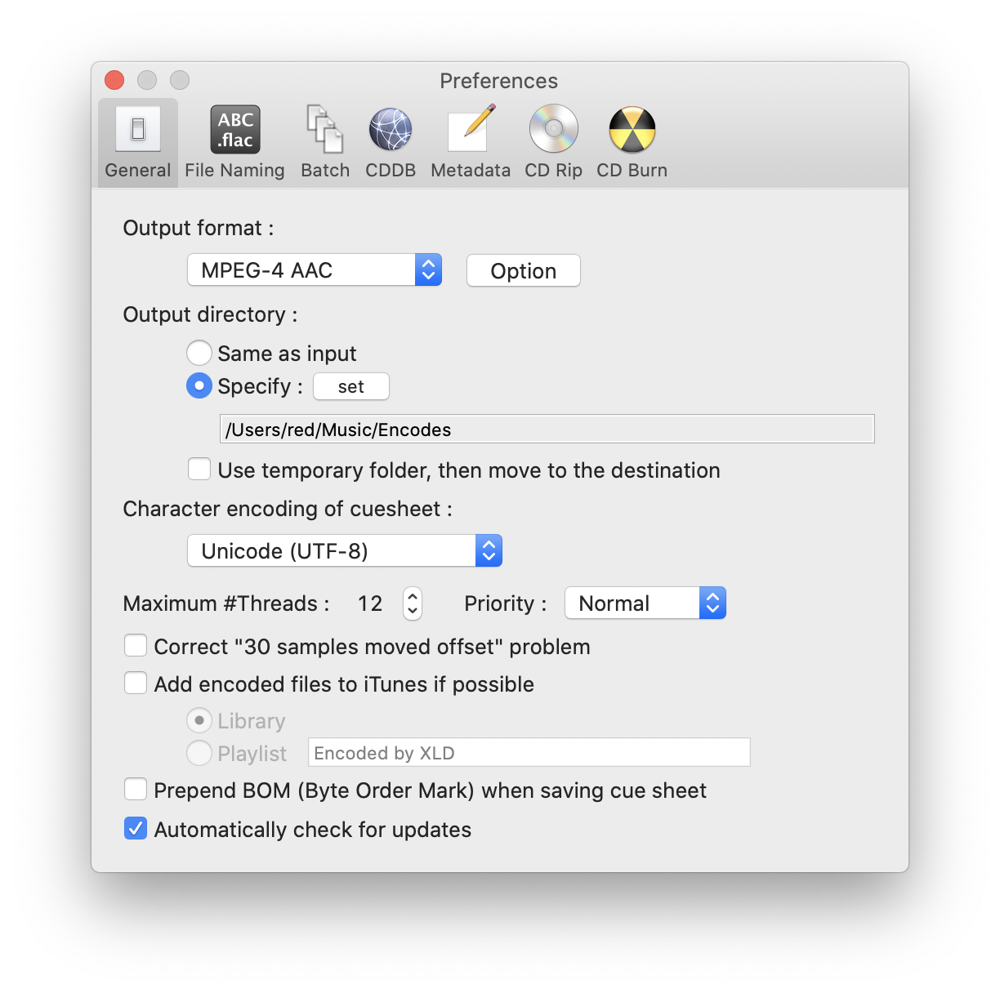
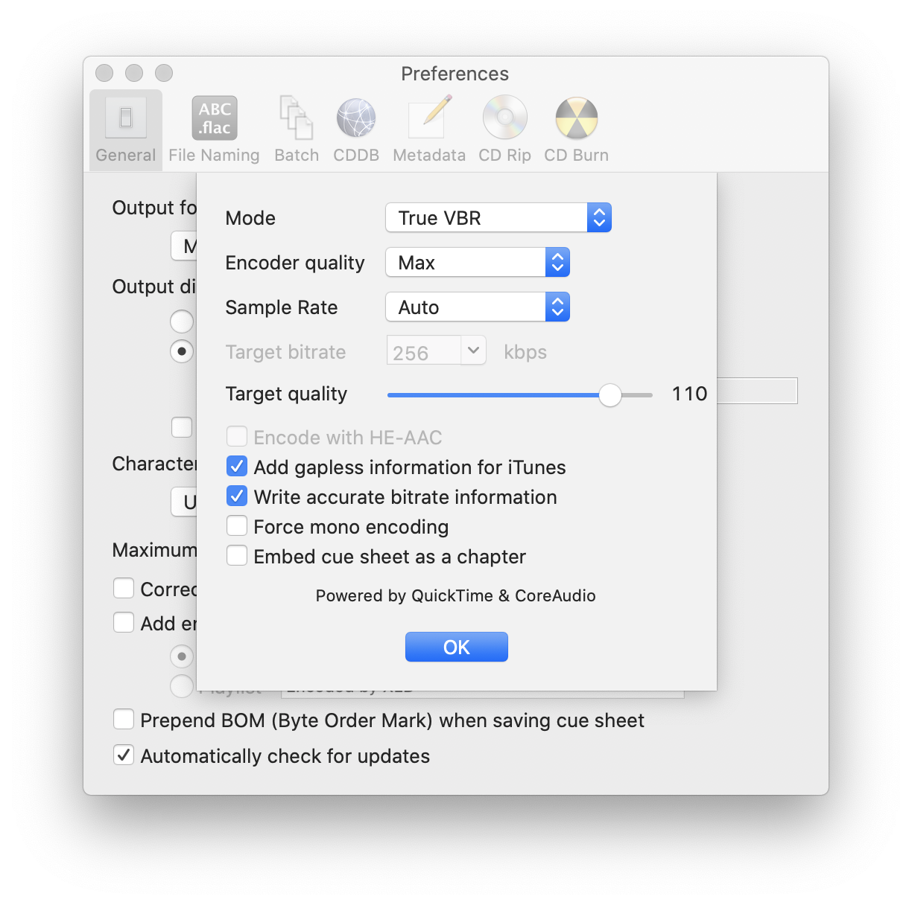

# XLD


```sh
# Install
brew cask install xld
```


## Preferences


**File Naming**

```
%A - %T (%y)/%n %a - %t
```


## AAC

> Note: I know there is mp3 and opus, but I am very satisfied with the results of the AAC/TrueVBR setting within XLD and will continue to use it for my music. It integrates into all my stuff and gives a very transparent result.





```ini
Output = MPEG4-AAC (QuickTime & Core Audio)
Mode = True VBR
Encoder Quality = Max
Sample Rate = Auto
Target Quality = 110
[x] Add gapless information to iTunes
[x] Write accurate bitrate information
```




